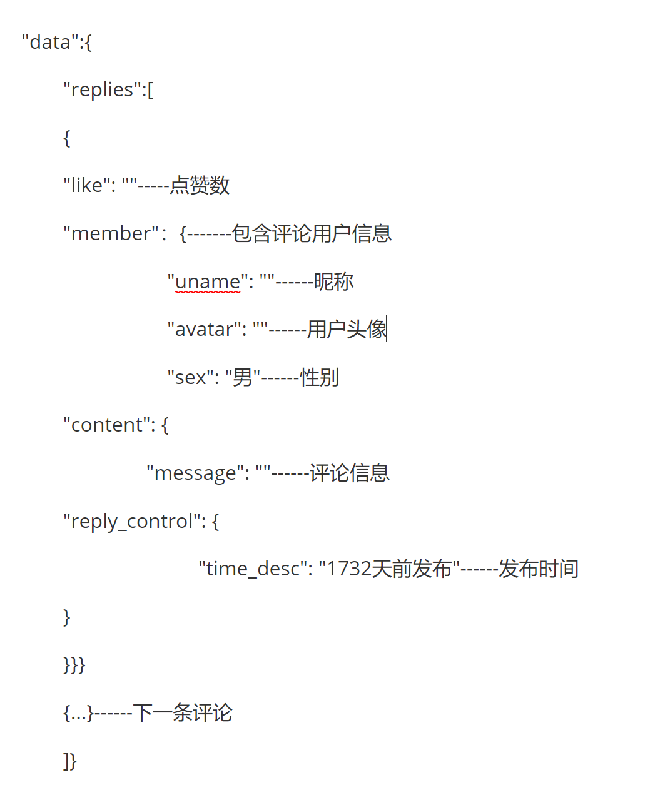
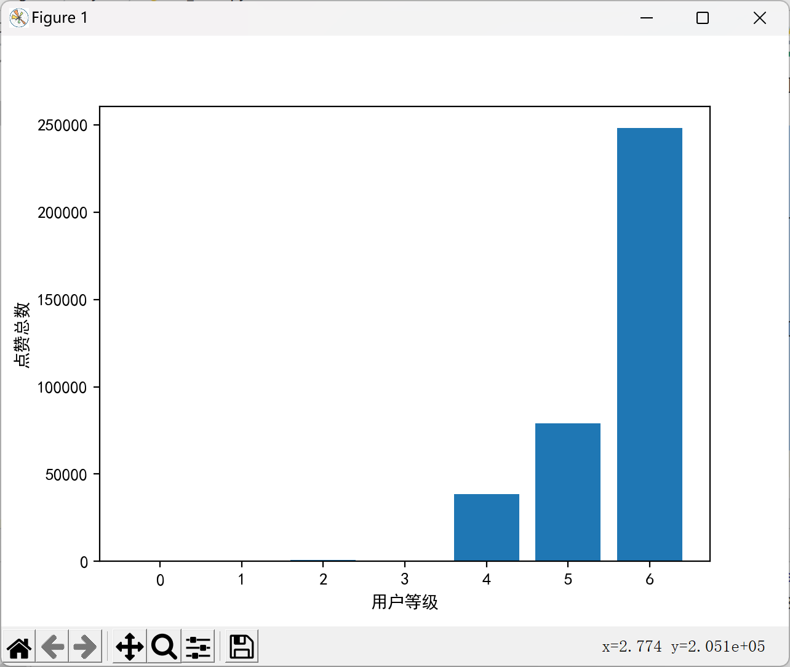
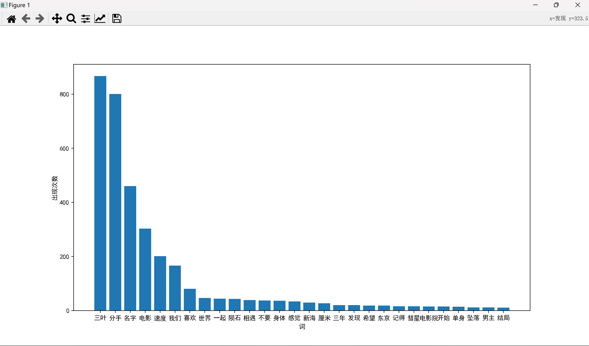

# bilibili-spyder
通过av号爬取B站视频评论，分析点赞量与等级的关系，评论词云

## 源数据获取；
数据源为B站视频评论
在加载新的一页评论时观察到访问的url
>https://api.bilibili.com/x/v2/reply/main?callback=jQuery172020167562580015508_1653393655707&jsonp=jsonp&next=4&type=1&oid=768584323&mode=3&plat=1&_=1653396013955
其中
>next:页数
>oid:视频av号
访问时带上head可以获得评论的json文件
## 评论json数据结构

## 过程
使用的库：requests，jieba，re，pandas，matplotlib，json，csv

1. ·from_bilibili_get_json.py·—获取评论json
2. ·like_level.py·---根据json得到不同等级用户的被点赞量并绘制柱状图
2. ·dejson.py·—收集所有评论到comment.txt
3. ·词频.py·-词频分析
4. ·keshijua.py·—可视化

## Results show
点赞量与等级的关系

评论词频

评论词云

